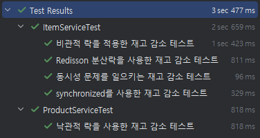
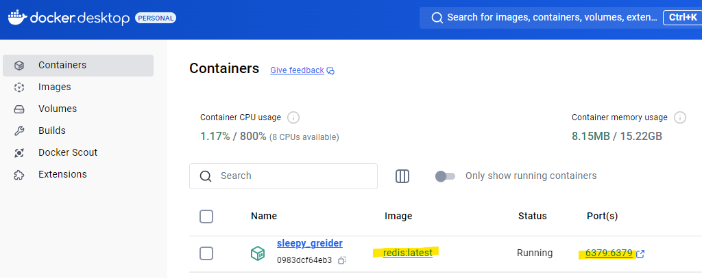

# 프로젝트 설명

동시성 이슈를 발생시키고 해결 방법에 대해서 실습한 프로젝트입니다.

다음과 같은 테스트가 실행됩니다.

Redisson을 사용한 분산락 테스트는 redis 서버가 필요합니다.

저의 경우에는 docker container를 사용했습니다.

코드에 주석으로 상세한 설명을 추가했습니다. 참고 부탁드립니다.

## 이슈 발생

DB 데이터를 읽고 쓰는 함수가 있습니다.

이 함수를 2개 이상의 스레드에서 동시에 실행시켜서 문제를 발생시킵니다.

## 문제 해결

### synchronized 키워드 사용

synchronized는 한 번에 하나의 스레드만 특정 코드 블록이나 메서드에 접근할 수 있도록 보장하기 때문에 멀티 스레드 환경에서 동시성을 보장할 수 있다.

하지만, @Transactional 애노테이션과 함께 사용하면 정상적으로 동작하지 않는다.

@Transactional 애노테이션은 대상 함수를 프록시 패턴을 사용해서 트랜잭션 처리한다.

1. 트랜잭션 시작
2. 함수 실행
3. 데이터 읽고 쓰기
4. 함수 종료
5. 트잭잭션 종료 (커밋)

함수가 종료되고 트랜잭션이 커밋되기 전에 다른 함수가 실행될 수 있다.

이렇게 되면 변경된 데이터가 반영되기 전에 다른 함수가 데이터를 읽을 수 있기 때문에 동시성 이슈가 발생한다.

그리고, synchronized는 하나의 프로세스에서만 동시성 이슈를 제어할 수 있기 때문에 좋은 방법은 아니다.

### 비관적 락 (Pessimistic Lock)

다른 트랜잭션이 해당 데이터에 접근하지 못하도록 락을 설정하는 방식.

`FOR UPDATE`을 사용한 쿼리라고 생각하면 쉽다.

- `FOR UPDATE`
    - FOR UPDATE가 실행되면 선택된 행(row)에 배타 락이 걸립니다.
    - 배타 락이 설정된 데이터는 해당 트랜잭션이 완료(Commit 또는 Rollback)될 때까지 다른 트랜잭션이 수정하거나 읽을 수 없습니다.
    - 즉, 동시 수정으로 인한 데이터 충돌을 방지합니다.

### 낙관적 락 (Optimistic Lock)

데이터베이스 수준에서 락을 걸지 않고 애플리케이션에서 데이터 변경의 충돌을 감지하고 처리하는 방식입니다.

이는 데이터 접근이 빈번하게 충돌하지 않을 것이라는 낙관적인 가정을 기반으로 설계됨.

쉽게 말하면 데이터가 동시에 접근됐을 경우에 예외처리를 통하여 동시성 이슈를 해결하는 것.

### Redisson을 사용한 분산 락

서버 애플리케이션에서 예외를 처리하거나 DB에 락을 거는 방법이 아니라 redis를 사용하여 락을 관리하는 방법.

redis 인스턴스를 통해서 lock을 생성 및 삭제한다.

- 분산 락이 필요한 경우
    - 데이터베이스 외부에서 동기화가 필요한 경우.
    - 여러 리소스(데이터베이스, 캐시, 파일 등)에 대한 락이 필요한 경우.
    - 데이터베이스 락이 성능 병목을 유발하는 경우.
    - 고가용성과 장애 복구를 위한 락 관리가 필요한 경우.
    - 데이터베이스가 스케일 아웃해서 2개 이상의 인스턴스로 구성된 경우.